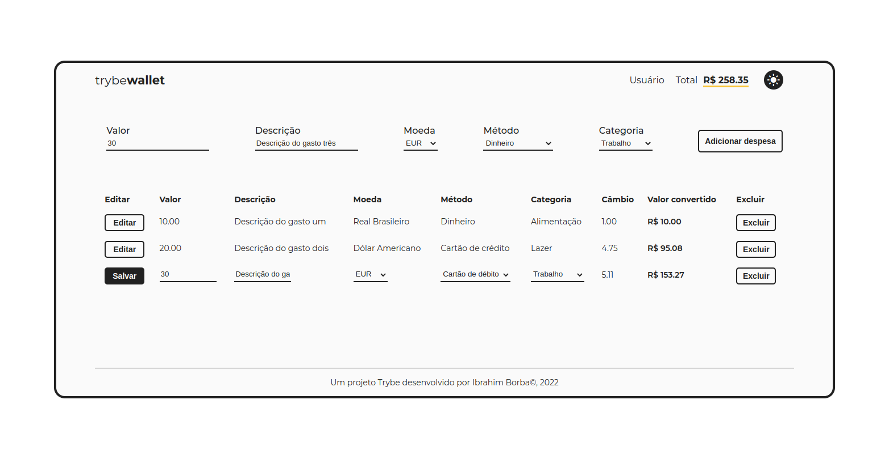
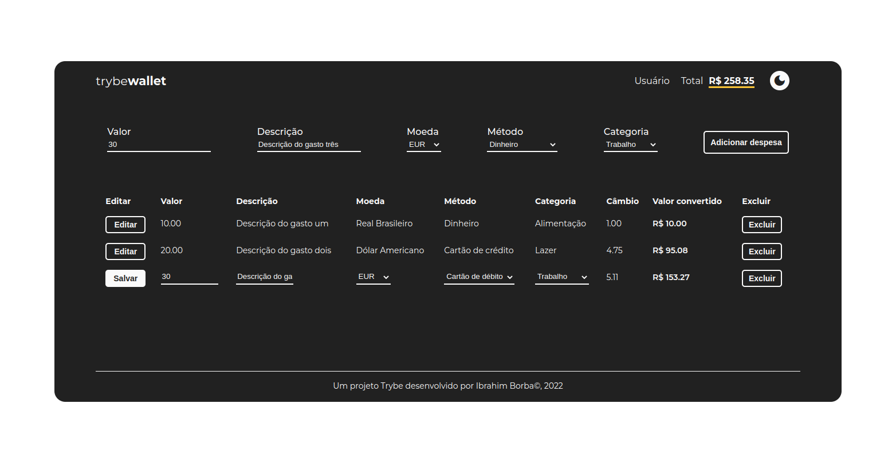

# Welcome to TrybeWallet project!
This is a [Trybe](https://www.betrybe.com/) project developed as part of the Frontend Module to exercise React and Redux.

---

# Summary
- [Welcome to TrybeWallet project!](#welcome-to-trybewallet-project!)
- [Summary](#summary)
- [Context](#context)
- [Technologies Used](#technologies-used)
- [Installing, running and testing the app](#installing-running-and-testing-the-app)
- [Notes](#technologies-used)
  - [Git and Commits](#git-and-commit)
  - [Further Improvements](#further-improvements)
- [Lint](#lint)
- [Preview](#preview)

---

# Context
This project is a __Finance App__ that allows the user to control their expenses through:
 * __Adding__ a new expense
 * __Edit__ existing expenses
 * __Delete__ unwanted expenses
 * __View__ the total amount of expenses

---

# Technologies Used
This project used the following technologies and features:
  * __React__ | [React Router](https://blog.pshrmn.com/simple-react-router-v4-tutorial/), [React Lifecycle](https://projects.wojtekmaj.pl/react-lifecycle-methods-diagram/), [State and Props](https://reactjs.org/docs/thinking-in-react.html), [Conditional Rendering](https://reactjs.org/docs/conditional-rendering.html)
  * __Redux__ | [State Management in Redux](https://blog.logrocket.com/why-use-redux-reasons-with-clear-examples-d21bffd5835/)
  * __Testing Library__ | [React Testing Library](https://kentcdodds.com/blog/common-mistakes-with-react-testing-library), [React Redux Testing Library](https://testing-library.com/docs/example-react-redux/)
  * __CSS__ | [Styled Components](https://styled-components.com/) 

---

# Installing, running and testing the app
### Install dependencies
```
cd trybewallet
npm install
```
### Run the application
```
cd trybewallet
npm start
```
### Run tests
```
npm test
```
---

# Notes
### Git, GitHub and Commit History
- There are only two branches since this is a solo project. One is the *main*, with production ready features. And the other one is *project_refactor*, where I improve the code and add new features.
- This project used the [Conventional Commits specification](https://www.conventionalcommits.org/en/v1.0.0/) with some types from [Angular convention](https://github.com/angular/angular/blob/22b96b9/CONTRIBUTING.md#-commit-message-guidelines).
- The deploy was made using [GitHub Pages](https://www.freecodecamp.org/news/deploy-a-react-app-to-github-pages/), being the host recommended by Trybe in other projects, it's the one I had more familiarity with.

### Further Improvements
- Increase test coverage
- Make it *Mobile First*
- Add *Design Pattern* for API requests
- Break *Wallet Page* form, table and table rows into components 
- Optmize *Styled Components* and dark/light mode structure

---

# Lint
The project was developed following the Clean Code standards specified by Airbnb's [ESLint](https://www.npmjs.com/package/eslint-config-airbnb) and [StyleLint](https://www.npmjs.com/package/stylelint-config-airbnb) rules, since it's one of the most implemented lint packages.

Some minor configuration changes were made to better fit [Trybe's Lint](https://github.com/betrybe/eslint-config-trybe), because the project was initially developed following said rules.

---

# Preview
To see and interact with the project preview [click here](https://ibrahimborba.github.io/trybewallet/).


| Light Mode | Dark Mode |
| --- | --- |
|  |  |